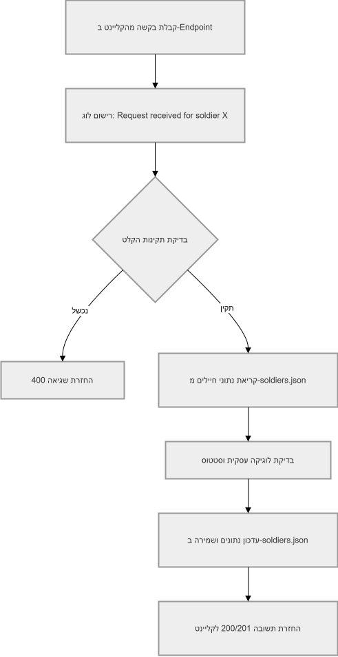

| Method | Path | פעולה | קלט | פלט | קוד תשובה |
| --- | --- | --- | --- | --- | --- |
| GET | `/soldiers` | קבלת כל החיילים | ללא קלט | רשימת מילונים של חיילים מהקובץ | 200 |
| GET | `/soldiers/{id}` | קבלת חייל לפי מזהה | id או מספר אישי | מילון עם פרטי החייל או הודעת שגיאה אם לא נמצא | 200 / 404 |
| POST | `/soldiers` | הוספת חייל חדש | מילון עם נתוני החייל החדש | הודעת הצלחה + אובייקט החייל שנוצר או הודעת שגיאה אם כבר קיים | 201 / 400 |
| PUT | `/soldiers/{id}` | עדכון חייל קיים | id או מספר אישי + מילון עם השדות לעדכון | הודעת הצלחה + אובייקט החייל המעודכן או שגיאה אם אין חייל כזה | 200 / 404 |
| DELETE | `/soldiers/{id}` | מחיקת חייל | id או מספר אישי | הודעת אישור על מחיקה או שגיאה אם אין חייל כזה | 200 / 404 |

